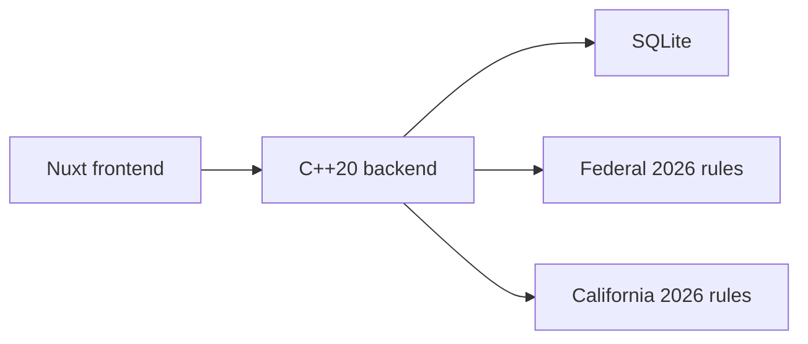
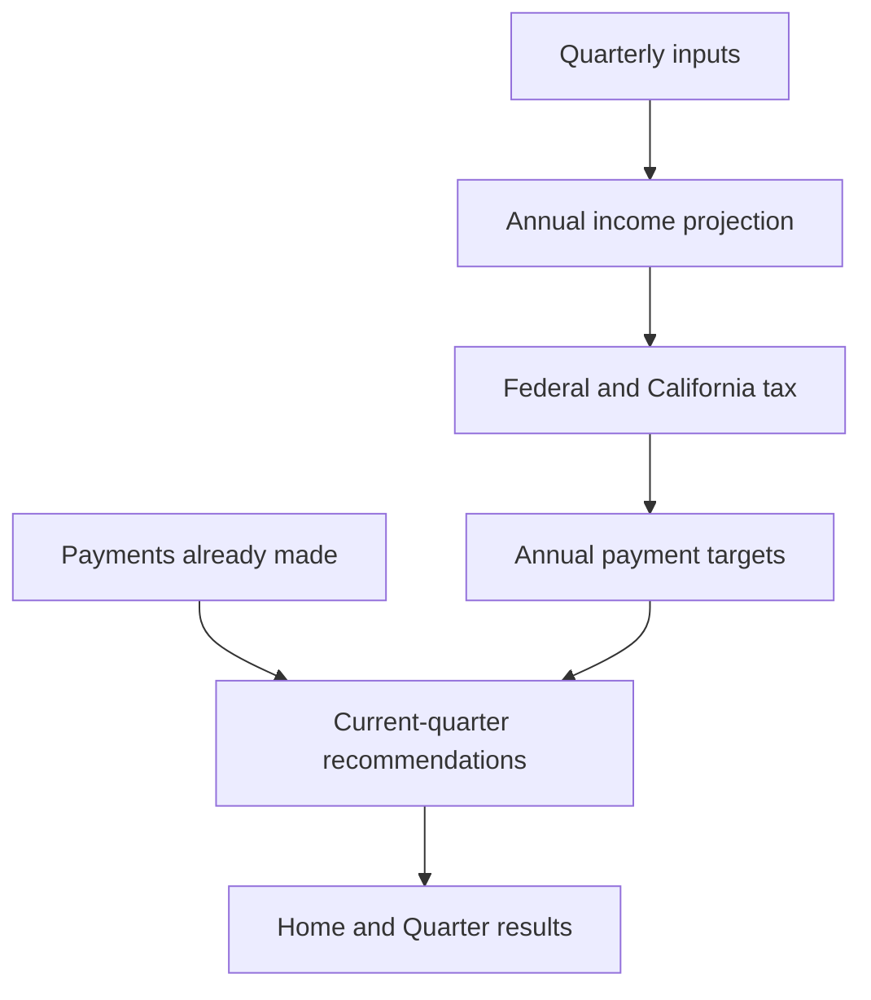

# Estimated Taxes Application Architecture

## Product definition

The application is a local 2026 tax-planning tool for one married couple filing jointly as full-year California residents. It accepts quarterly payroll and investment information, estimates annual federal and California tax, and recommends the amount currently owed for each jurisdiction.

The estimate may be imperfect. Simplicity, clarity, and explainability are more important than covering every tax situation.

## System context

The application runs locally. It has no login, remote services, automatic tax-rule downloads, payment transmission, payroll connection, or brokerage connection.

## Fixed product scope

- Tax year 2026 only
- Married filing jointly only
- Full-year California residents only
- Up to two spouses
- One latest paystub snapshot per spouse per quarter
- Paystub values are YTD; investment values are quarter-specific
- Quarterly ordinary and qualified dividends
- Quarterly net short-term and long-term stock gains or losses
- Federal and California withholding
- Federal and California estimated payments
- Configurable federal and California tax rates and thresholds stored in SQLite
- Projected-current-year liability method only
- Optional saved calculation snapshots without comparison features

## Explicit exclusions

- Other filing statuses, tax years, states, and residency models
- Job modeling, future jobs, or user-entered future-income expectations
- Capital-loss carryovers
- Itemized deductions and above-the-line deductions
- Federal credits and specialized California credits
- Manual deductions, credits, other taxes, or generic tax adjustments
- Federal or California AMT
- Self-employment, business, rental, partnership, foreign, retirement, and Social Security income
- Individual brokerage transactions, tax lots, cost basis, and wash-sale calculations
- Safe-harbor, annualized-installment, penalty, and interest calculations
- Tax filing, payment submission, or tax-form generation
- Trend charts and trend-based extrapolation in the MVP

## Architecture principles

1. **Quarter-centered workflow:** the quarter is the primary unit of data entry and review.
2. **Clear data semantics:** paystub snapshots are cumulative YTD values; investments are quarter-only values.
3. **One understandable projection:** no scenario engine or user-entered future assumptions.
4. **Data-driven tax values:** rates, brackets, thresholds, deductions, credits, dates, and installment percentages are editable rule data.
5. **Fixed tax behavior:** calculation ordering and semantics are application behavior, not editable formulas.
6. **Explainable results:** headline recommendations reconcile with their supporting calculation stages.
7. **Historical integrity:** saved snapshots and prior rule revisions retain the values that produced them.
8. **Local ownership:** household data, rules, logs, and backups stay local.

## Architecture documents

Start with the [implementation milestones](implementation-milestones.md) for the ordered delivery and review gates. The documents below remain the authority for behavior within each milestone.

### Backend

1. [Scope and domain](backend/01-scope-domain.md)
2. [Quarterly data and projection](backend/02-quarterly-data-projection.md)
3. [Tax calculation](backend/03-tax-calculation.md)
4. [Tax-rule management](backend/04-tax-rules.md)
5. [Quarterly payment recommendations](backend/05-payment-recommendations.md)
6. [Results, validation, and local operations](backend/06-results-validation-operations.md)
7. [Frontend/backend JSON API](backend/07-api-contract.md)

The backend files are ordered by calculation flow. The implementation milestone plan defines delivery dependencies, including building rule management before the calculation that consumes those rules.

### Frontend

- [Frontend architecture](frontend.md)
- [Frontend design language](frontend-design-language.md)

The frontend architecture defines pages and workflow. The design-language document defines the approved Nuxt UI dark theme, component boundary, reuse strategy, and future ECharts presentation.

### Implementation handoff

- [Implementation milestones](implementation-milestones.md)

The milestone plan links backend and frontend work to the authoritative plans, states dependencies and completion gates, and identifies technical choices intentionally left to the implementation agent.

## Calculation flow

## Official rule sources

Initial defaults should be traceable to official publications, including:

- [IRS 2026 Form 1040-ES](https://www.irs.gov/pub/irs-pdf/f1040es.pdf)
- [IRS 2026 inflation adjustments](https://www.irs.gov/newsroom/irs-releases-tax-inflation-adjustments-for-tax-year-2026-including-amendments-from-the-one-big-beautiful-bill)
- [California 2026 Form 540-ES instructions](https://www.ftb.ca.gov/forms/2026/2026-540-es-instructions.html)
- [California estimated-payment schedule](https://www.ftb.ca.gov/pay/estimated-tax-payments.html)

The source links establish provenance. They do not replace verification tests for the supported rules.
