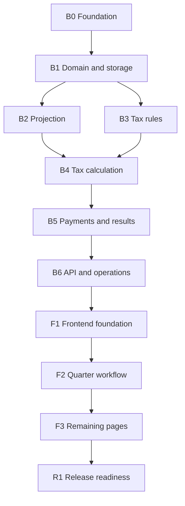

# Implementation Milestones

## Purpose

Provide an ordered handoff for an implementation agent. Each milestone links to the authoritative architecture documents and ends with an independently reviewable result.

The milestones describe capabilities and completion gates. They do not override the architecture documents or require a particular library, directory layout, or class structure.

## Dependency order

## Backend milestones

### B0: Foundation

**Plans:** [Architecture overview](README.md), repository `AGENTS.md`

**Outcome:** A minimal C++20 backend project can be built, started locally, configured, and tested.

**Completion gate:**

- Build and test commands work from a clean checkout.
- Local database and log locations are configurable.
- Logging supports `error`, `info`, and `debug` through configuration or command-line options.
- No product behavior beyond startup is introduced.

### B1: Domain and SQLite storage

**Plans:** [Scope and domain](backend/01-scope-domain.md), [Results, validation, and local operations](backend/06-results-validation-operations.md)

**Outcome:** The household and quarterly input model can be stored and retrieved locally.

**Completion gate:**

- A SQLite connection is established, and the schema initializes and upgrades through explicit migrations.
- Household and spouse records can be persisted with exactly four quarter records.
- Paystub snapshots, quarterly investment summaries, and federal and California estimated payments can be persisted and retrieved.
- Saving a whole quarter atomically replaces its prior input records.
- `null`, explicit zero, YTD paystub data, and quarter-specific investment data retain their documented meanings.
- Domain unit tests cover the household and quarterly input model.
- SQLite integration tests prove round-trip behavior and transaction rollback on failed writes.

### B2: Annual projection

**Plans:** [Quarterly data and projection](backend/02-quarterly-data-projection.md), [Scope and domain](backend/01-scope-domain.md)

**Depends on:** B1

**Outcome:** Quarterly facts produce one explainable annual wage and withholding projection.

**Completion gate:**

- The latest eligible paystub is selected independently for each spouse.
- Remaining pay periods use the documented deterministic approximation.
- Bonuses are included in YTD wages but not repeated.
- Bonus-related withholding follows the documented fallback order.
- Quarterly investment values are summed and never projected into future quarters.
- Actual, projected-remaining, and projected-annual totals reconcile.
- Boundary and missing-data tests produce the documented warnings.

### B3: Tax-rule management and official defaults

**Plans:** [Tax-rule management](backend/04-tax-rules.md), [Tax calculation](backend/03-tax-calculation.md), [Architecture overview](README.md#official-rule-sources)

**Depends on:** B1

**Outcome:** Complete, sourced federal and California rule revisions are available to the calculation engine and editable through the approved lifecycle.

**Completion gate:**

- Official default values are verified against the linked agency publications; API examples are not used as tax fixtures.
- Every value required by the supported formulas is present with provenance and verification date.
- The California defaults follow the 2026 Form 540-ES direction to use the applicable 2025 tax schedule and exemption credit.
- Invalid, incomplete, overlapping, or noncontiguous rules are rejected atomically.
- Tax-rule revisions, active rule references, and archived revisions are persisted.
- Save and restore create revisions without changing old snapshots.
- Official defaults remain immutable.

### B4: Federal and California tax calculation

**Plans:** [Tax calculation](backend/03-tax-calculation.md), [Tax-rule management](backend/04-tax-rules.md)

**Depends on:** B2 and B3

**Outcome:** The annual projection produces deterministic federal and California liabilities and withholding balances.

**Completion gate:**

- Capital gains and losses match every row of the documented netting table.
- Ordinary brackets, preferential stacking, deductions, NIIT, Additional Medicare Tax approximation, California exemption credit, and Behavioral Health Services Tax follow the documented order.
- Integer-cent and rate rounding behavior is consistent throughout.
- Federal and California results remain independent.
- Tests cover every bracket boundary, capital-netting combination, supported additional-tax threshold, zero-income case, and custom rule revision.
- Calculation details reconcile to the headline liability.

### B5: Recommendations, results, validation, and snapshots

**Plans:** [Quarterly payment recommendations](backend/05-payment-recommendations.md), [Results, validation, and local operations](backend/06-results-validation-operations.md)

**Depends on:** B4

**Outcome:** Annual liabilities become current-quarter federal and California recommendations with explainable status and warnings.

**Completion gate:**

- Federal and California cumulative schedules and prior payments produce the documented recommendation, scheduled portion, and catch-up portion.
- Rounded installments reconcile to the annual target.
- Payment dates and current/past-due states follow the as-of date.
- Blocking, caution, and informational outcomes are distinguishable.
- Saved snapshots are persisted and preserve one immutable, internally consistent calculation and rule revision.
- Editing current data does not rewrite snapshots.

### B6: JSON API and local operations

**Plans:** [Frontend/backend JSON API](backend/07-api-contract.md), [Results, validation, and local operations](backend/06-results-validation-operations.md)

**Depends on:** B1 through B5

**Outcome:** The complete supported backend is available through the documented coarse-grained local API.

**Completion gate:**

- All documented endpoints, JSON shapes, status codes, and atomicity guarantees are implemented.
- `GET` and `PUT` operate on whole household, quarter, and rule resources; `PATCH` and field-level endpoints are absent.
- Successful saves return refreshed derived results.
- Unknown fields and domain validation failures use the documented error envelope.
- Complete SQLite backup and full-replacement restore work safely.
- Logs avoid sensitive financial payloads.
- API-level tests exercise representative success, validation, rollback, and restore paths.

## Frontend milestones

### F1: Frontend foundation

**Plans:** [Frontend architecture](frontend.md), [Frontend design language](frontend-design-language.md), [JSON API](backend/07-api-contract.md)

**Depends on:** Stable B6 API contract

**Outcome:** A dark Nuxt UI application shell can load backend state and present shared financial UI patterns.

**Completion gate:**

- Home, Quarters, History, and Settings navigation exists.
- The approved dark semantic theme is applied consistently.
- Shared money formatting/input, metric, jurisdiction, warning, and save-state patterns exist only where required.
- Frontend API models match the documented JSON contract.
- Loading, empty, validation, and backend-error states are present.
- No tax calculation is duplicated in the frontend.
- No charts are implemented.

### F2: Current and historic Quarter workflow

**Plans:** [Frontend architecture](frontend.md#quarter-page), [Frontend design language](frontend-design-language.md), [JSON API quarter resource](backend/07-api-contract.md#quarter-resource)

**Depends on:** F1 and B6

**Outcome:** A user can complete the primary quarter-centered workflow on one page.

**Completion gate:**

- The same page implementation handles Q1 through Q4 and current or historic states.
- One paystub section per spouse, investments, and estimated payments are edited together.
- Successful save replaces the whole quarter and refreshes annual and jurisdiction results.
- Federal and California amounts owed are prominent and clearly separated.
- Quarter-only versus YTD inputs, bonus behavior, warnings, and save state are clear.
- Historic edits update the current annual result without recreating an old recommendation.

### F3: Home, History, and Settings

**Plans:** [Frontend architecture](frontend.md#home), [Frontend architecture: History](frontend.md#history), [Frontend architecture: Settings](frontend.md#settings), [Frontend design language](frontend-design-language.md)

**Depends on:** F2

**Outcome:** All remaining MVP workflows are accessible through the approved shared patterns.

**Completion gate:**

- Home presents actuals, annual projection, taxes paid, recommendations, and quarter status.
- History supports snapshot save, view, rename, and delete without comparison features.
- Settings supports household values, tax-rule editing/restoration, and SQLite backup/restore.
- Destructive restore and unsaved navigation require confirmation.
- Federal/California and actual/projected/paid/recommended meanings remain visually explicit.
- No charts, logging UI, authentication, or out-of-scope configuration is added.

## Release milestone

### R1: Local MVP readiness

**Plans:** All architecture documents

**Depends on:** B0-B6 and F1-F3

**Outcome:** The application can be handed to a local user as the approved 2026 planning estimate.

**Completion gate:**

- A clean local setup can build and run the backend and frontend using documented commands.
- A representative two-spouse case can be entered, saved, restarted, recalculated, backed up, restored, and reviewed.
- Headline values reconcile with calculation details and stored inputs.
- Official and customized tax-rule states are identifiable.
- Supported approximations and omitted situations appear as documented warnings.
- All automated tests pass and no MVP exclusion has been implemented accidentally.

## Choices intentionally left to the implementation agent

The implementation agent may choose these mechanics as long as the documented behavior and standards remain intact:

- C++ build system details and dependency-management approach
- HTTP, JSON, SQLite, and test libraries
- Internal namespaces, file layout, function boundaries, and class names
- Nuxt project organization beneath the documented page/component boundaries
- Development-time process and proxy configuration
- Whether a packaged local build serves frontend assets from the backend or starts two local processes

Choose the smallest conventional option. Record a material architectural choice in the relevant plan before relying on it broadly.

## Handoff rules

- Read `AGENTS.md`, then the architecture overview, then the documents linked by the active milestone.
- Work on one milestone at a time and stop at its completion gate.
- Do not treat example JSON values as legal tax data or calculation fixtures.
- Do not implement future ideas or excluded features to make an abstraction more general.
- If a required behavior conflicts across documents, stop and update the architecture decision before coding through the ambiguity.
- Keep each milestone reviewable without requiring unfinished work from a later milestone.
